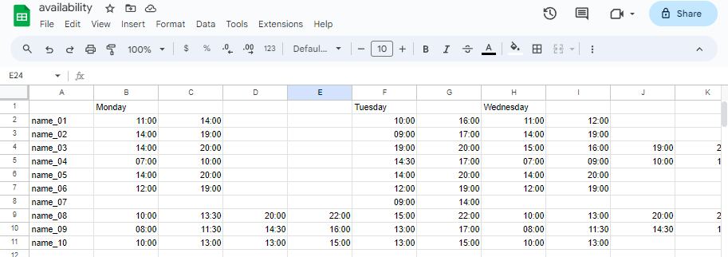
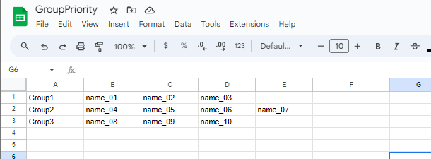

# TeamCreator
## Description
Application to take peoples availabilities and assign them to valid teams  

## Install
- pip install tkinter

## Usage
- download everyones availability as a csv and make sure to save it to resources as "availability.csv"
- download the group priority as a csv and make sure to save that in resources as "group_priority.csv"

### Example for availability before csv download

### Example for group priority before csv download

